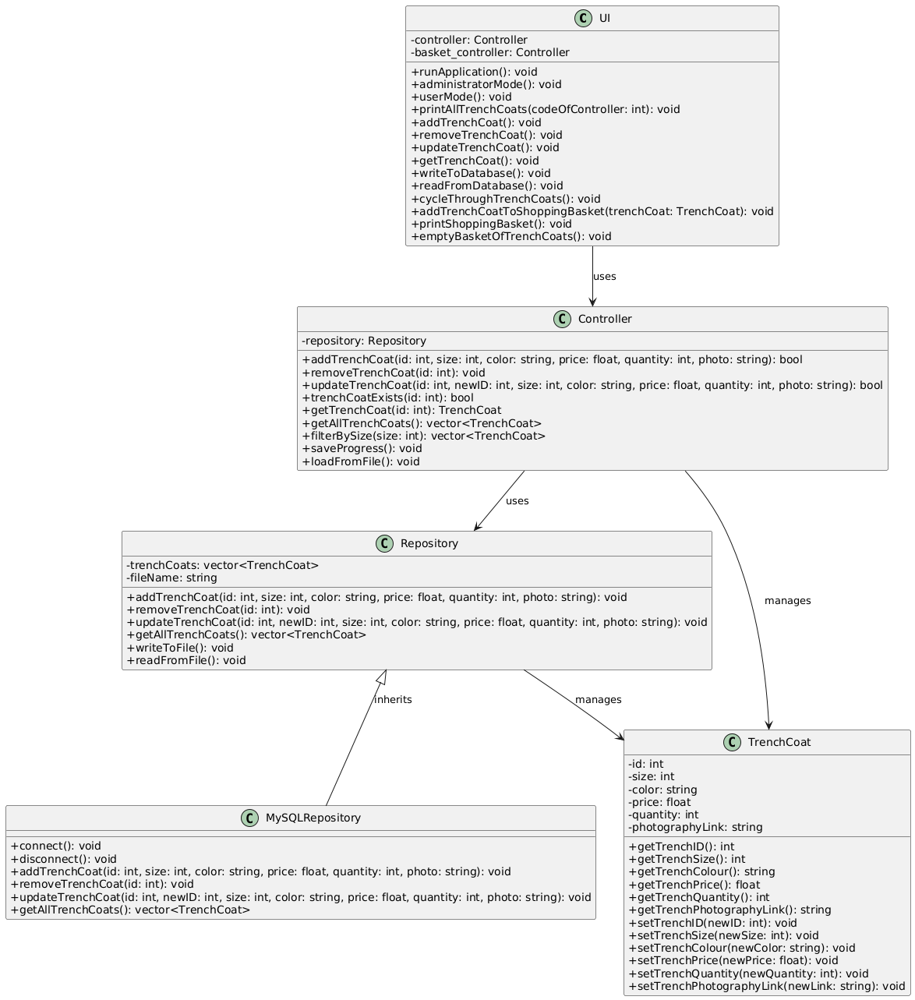

# TrenchCoats Management Application

This is a C++ application that manages a collection of trench coats. It includes two user modes: administrator mode for inventory management and user mode for browsing and shopping functionalities. The application supports persistent storage and is designed using object-oriented principles with clear separation of concerns.

## Features

### Administrator Mode
- Add new trench coats to the inventory
- Remove trench coats by ID
- Update existing trench coats
- View all trench coats in the inventory
- Save/load data from file or database

### User Mode
- Browse available trench coats
- Filter coats by size
- Add trench coats to a shopping basket
- View and empty the shopping basket

## Class Overview

### `TrenchCoat`
Represents a trench coat with attributes:
- ID
- Size
- Color
- Price
- Quantity
- Photo URL

### `Repository`
Handles all storage-related operations:
- Add, remove, update trench coats
- Save/load data from file
- Retrieve and filter trench coats

### `MySQLRepository`
Extends `Repository` for MySQL database support:
- Connect/disconnect from database
- Same CRUD operations as base repository

### `Controller`
Intermediary between the UI and the data layer:
- Manages both administrator and user operations
- Interfaces with `Repository`

### `UI`
User interface controller:
- Manages application flow for both modes
- Handles user interactions

## UML Diagram

The following UML diagram illustrates the structure and relationships of the classes in this project:

